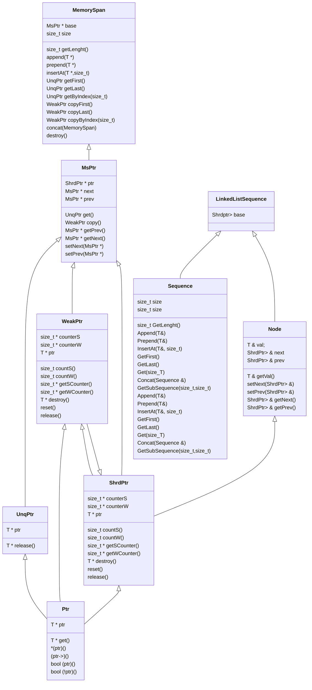

# First lab by Bredihin Vladimir B23-554
## Getting started

 1. Make sure you have have installed C++ complier and CMake(3.8 or higher)
 2. To visualize charts, the [matplot++](https://alandefreitas.github.io/matplotplusplus/) is used in this project
 ## Project sructure
 

